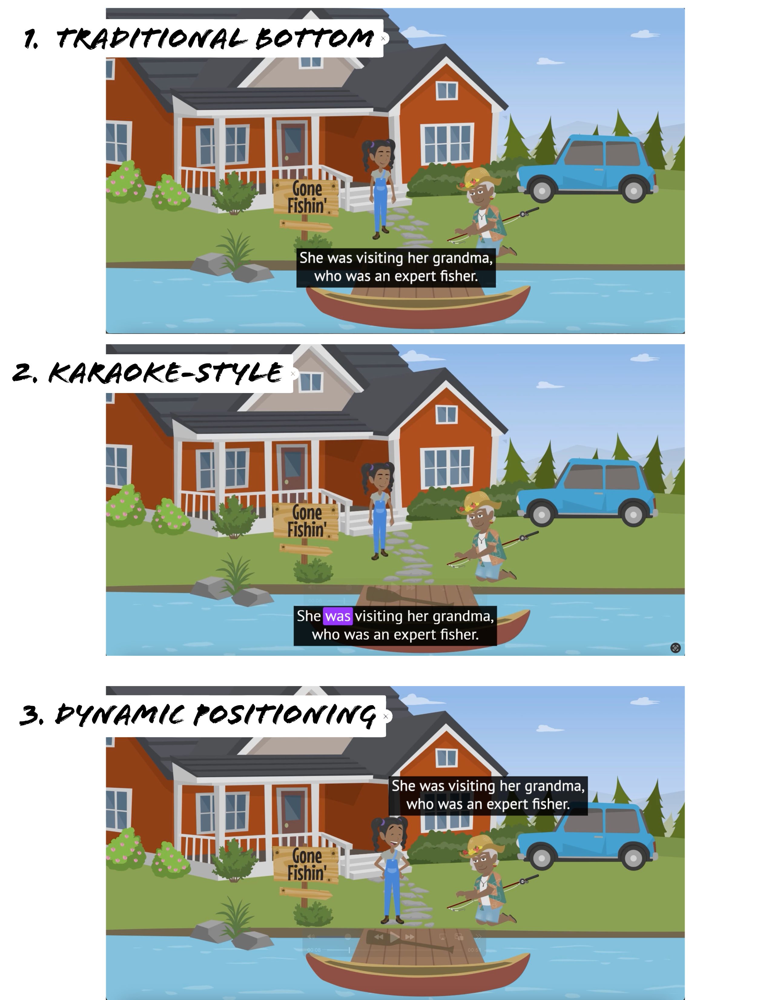

# Overview

The journey of becoming skilled readers can be one of the toughest challenges for children. However, something they thoroughly enjoy, without any struggle, is spending countless hours engaging online. Closed captions in these videos can be a game-changer in this learning adventure. By making captions more effective, we can transform screen time into a more enriching reading experience for kids. This can significantly immprove their reading skills, word recognition, comprehension, and overall enjoyment of content, as research suggests. These captions are especially crucial for children with hearing impairments, limited reading abilities, or those who speak a different language from the content.

With a diverse range of content, CBC Kids has attracted a massive following of Canadian children and youth, with an average of two million monthly visits across their digital platforms[^1].

[^1]: <https://cbc.radio-canada.ca/en/your-public-broadcaster/blog/cbc-kids-news-helping-kids-safer-savvier-online>

## Research Goals

In this project, in collaboration with CBC, CanChild and the Reading Lab research centers of McMaster, our goal is to enhance and support the viewing experiences of the young viewers by making captions more readable and effective.

After considering several factors, including closed captioning rate, editing, line breaks, typography), we decided to investigate the factors of attention enhancing manipulation (as shown in the karaoke-style in the Figure) and positioning (as shown in the dynamic positioning in the Figure) on the efficiency of closed captions, with the traditional conventional bottom presentation (as shown in the bottom positioning in the Figure).

## Business Value

CBC Kids isn't just about creating content; they're also dedicated to supporting educational journeys through initiatives like CBC Kids News, Street Cents, and CBC Kids at School. Improving closed captions in children's programming will empower millions of young minds at home and school. This research effort will reinforce CBC Kids' reputation as a trusted source for both entertainment and educational content, showcasing their commitment to providing enriching experiences for children across Canada.

## Metholodology

In our methodology, I combined attitudinal research with behavioral research techniques, including eye-tracking technology and A/B testing. Attitudinal research helped us understand viewer preferences, which closed caption style they liked most. While A/B tests allowed us to compare the influence of these different styles their understanding of content. Eye-tracking provided valuable insights, especially during in-person tests, revealing where and when viewers paid attention.

We conducted tests both remotely and in person from 67 children.

## Achieved MilesStones:

As a Primary Quantitative User Experience Researcher (UXR), I took charge of critical aspects within research projects:

-   Successfully submitted and obtained approval for REB applications.
-   Conducted competitive and secondary research, analyzing scientific literature to identify industry trends and key areas for enhancing closed caption presentations.
-   Implemented eye tracking and online surveys, as well as test materials, to gather comprehensive data.
-   Led a team of 2 Research Assistants, providing training and overseeing the recruitment of 67 children for in-person and online testing.
-   Developed efficient R code for analyzing survey responses and eye movement data, resulting in actionable insights.
-   Transformed raw data from eye-tracking tests and online user surveys into visually insightful representations using ggplot2 and Tableau, facilitating the identification of hidden patterns and insights.
-   Delivered over 20 reports and presentations that distilled complex topics like literature findings and research results into easily understandable and concise formats for senior leadership. This ensured their efficient understanding of key insights and kept them up to date with the latest information.
