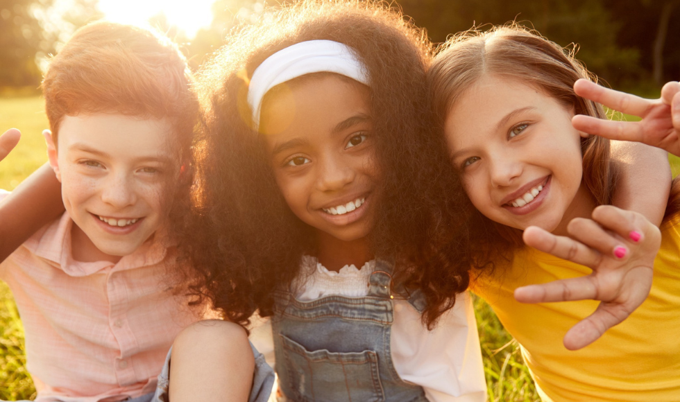

# Overview

I am incredibly grateful to McMaster University for the opportunity to be interviewed and for featuring our study on Brighter World! It's an honor to have our work shared by such a respected institution in the field. 🤟

Click [here](https://brighterworld.mcmaster.ca/articles/researchers-team-up-with-cbc-kids-to-make-closed-captions-better/) to read the interview.

I want to thank our dear Nadia Lana and the whole team for their support and for providing a platform to share our research findings with a wider audience. I look forward to more collaborations and contributions between the academic community and industry!

A special shoutout of appreciation to our collaborators CanChild McMaster, Reading Lab, CBC and individuals Dr. Victor Kuperman, Dr. Olaf Kraus de Camargo, Dayle McCauley, Karen Clout, Olena Sullivan, CPACC, Niki Ramesh, Sarah Duda, Lucy Thomas, Brittany Zaretsky for their invaluable contributions to this project.
